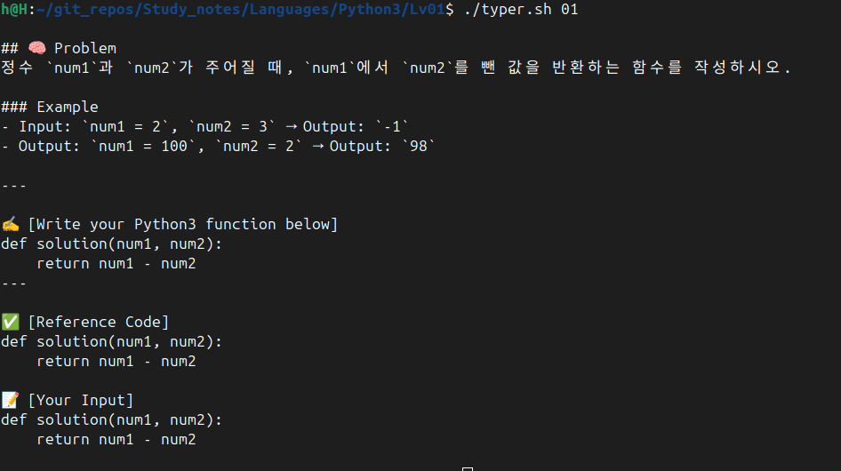
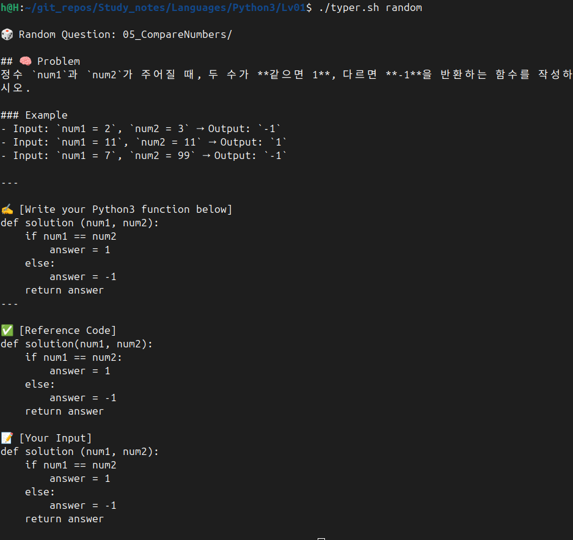

## ⚠️ 아이디어 또는 코드를 무단으로 사용하거나 상업적으로 활용하는 것을 금합니다.

추가 고지: 본 프로젝트는 실험 목적의 학습 기록으로, MIT 라이선스를 따르되, 
README.md 상에 명시된 바와 같이 아이디어의 무단 도용 및 상업적 사용은 금지됩니다.


---

# 🧠 Python3 CLI Typer

Python3 기초 문법 문제를 반복 타이핑하며 학습하는 CLI 도구입니다. 
문제 설명과 코드 입력을 CLI 터미널에서 직접 보여주며, 
코딩 습관과 문법 기억을 동시에 훈련하는 것이 목적입니다.
이 자료에 포함된 모든 문제는 Programmers에 수록된 Python3 문제입니다.

---

## 📂 폴더 구조 예시

```
Typer/
│ ├── 01/
│ │ └── README.md
│ ├── ../
│ └── 50/
├── typer.sh
└── README.md
```

---

## 🚀 실행 화면



---



---

## ✅ 목적

- Python 문법을 반복 입력을 통해 자연스럽게 습득
- CLI 중심 학습 루틴 수립

---

## 💡 Tip

- typer.sh는 문제 폴더들의 상위 디렉토리에 위치해야 합니다.
- Linux / WSL 환경에서 사용을 권장합니다.

---

## 🔄 프로젝트 업그레이드 예정 사항 (v2.0)

기존 `typer.sh` 기반 CLI를 Python으로 포팅하여, 보다 폭넓은 운영체제에서 실행 가능하고, `.exe` 형태로도 배포 가능한 학습 도구로 업그레이드할 예정입니다.

### 🔧 변경 및 개선 예정 사항

| 항목 | 기존 (v1.0) | 업그레이드 후 (v2.0) |
|------|-------------|-----------------------|
| 실행 방식 | `./typer.sh 문제번호` | `typer.exe` 실행 후 인터랙티브 CLI |
| 호환 OS | Linux/WSL 전용 | Windows 포함 전체 OS 지원 |
| 배포 방식 | Bash 파일 직접 복사 | `.zip` 압축 파일 배포 (문제 + 실행파일 포함) |
| 구현 언어 | Bash | Python + `argparse` |
| 입력 기능 | 기본 `read` 함수 | 커서 이동/재입력 등 확장 가능 |

### 🗂 예상 배포 구조 예시

```
typer-v2.0/
├── Problems/
│   ├── 01/README.md, Explanation.md
│   ├── 02/README.md, Explanation.md
│   └── ...
├── typer.exe
└── run.bat (선택, 자동 실행용)
```

---

💡 v2.0은 학습자 편의성과 배포 확장성을 고려한 Python 기반 CLI 학습 도구로, `.exe` 실행만으로도 자동 실행되도록 설계될 예정입니다.

---

## 🙋‍♂️ Made by Xellos216
이 CLI 도구는 Python 문법 학습을 위해 제작자가 직접 설계하고 구현한 프로젝트입니다.
- GitHub: [github.com/Xellos216](https://github.com/Xellos216)
- Version: v1.0 (2025.07.16)

